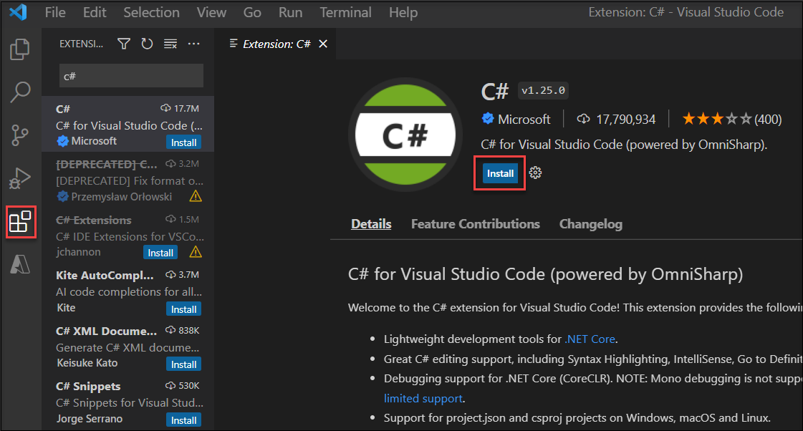
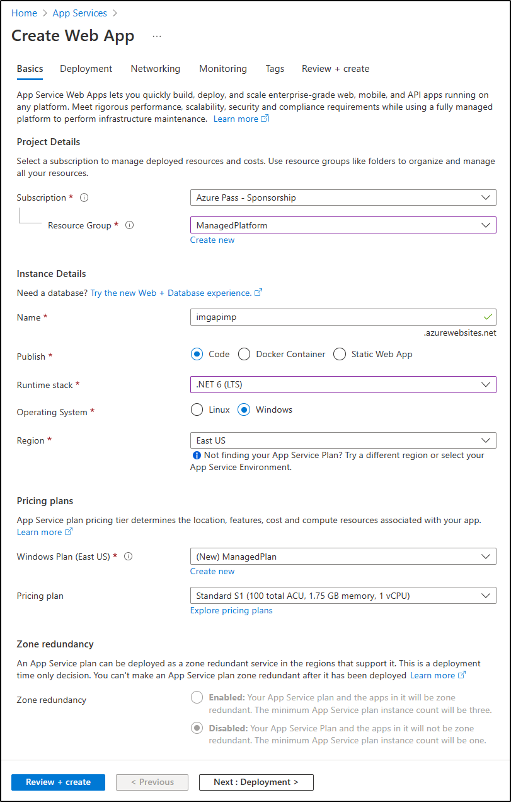
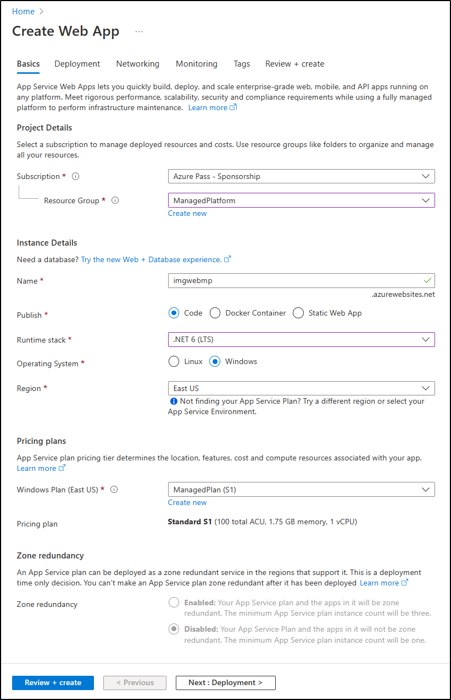
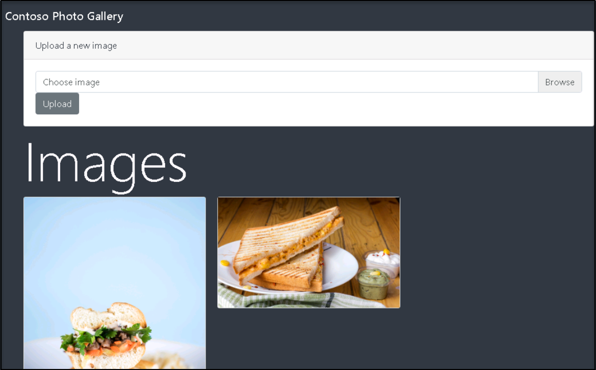

# Lab 01: Build a web application on Azure platform as a service offering

## Architecture diagram


## Lab setup and pre-requisites

Before starting this lab, you must complete **Prerequisites** of this lab.

To install **C#** extension for this lab, follow the below steps in visual studio code:

1. Start Visual Studio Code.

     

2. Select the **Extensions** blade from the left panel.
3. Search with **C#** and select **Install** to install the extension.

    

4. After installing C# extensions, close the Visual studio code.

### Exercise 1: Build a backend API by using Azure Storage and the Web Apps feature of Azure App Service

#### Task 1: Open the Azure portal

1. If you are not logged in already, click on Azure portal shortcut that is available on the desktop and log in with Azure credentials.

1. To get the Azure credentials select the **Environment Details** tab from the lab environment details page.

    
    
1. On the Welcome to Microsoft Edge page, select **Start without your data** and on the help for importing Google browsing data page, select the **Continue without this data** button. Then, proceed to select **Confirm and start browsing** on the next page.

#### Task 2: Create a Storage account

1. In the Azure portal, use the **Search resources, services, and docs** text box to search for **Storage Accounts**, and then in the list of results, select **Storage Accounts**.

1. On the **Storage accounts** blade, select **+ Create**.

1. On the **Create a storage account** blade, on the **Basics** tab, perform the following actions, and then select **Review**:

    | Setting                         | Action                                                       |
    | ------------------------------- | ------------------------------------------------------------ |
    | **Subscription** drop-down list | Retain the default value.                                    |
    | **Resource group** section      | Select **ManagedPlatform-[deployId]**. |
    | **Storage account name** text box | Enter  **imgstor[deployId]**.             |
    | **Region** drop-down list       | Select **(US) East US**. |
    | **Performance** section | Select the **Standard** option. |
    | **Redundancy** drop-down list | Select **Locally-redundant storage (LRS)**. |
    >Note : **[deployId] can be found in the environment tab**

    The following screenshot displays the configured settings on the **Basics** tab of the **Create a storage account** blade.

    

1. On the **Review** tab, review the options that you selected during the previous steps.

1. Select **Create** to create the storage account by using your specified configuration.

    > **Note**: Wait for the creation task to complete before you proceed with this lab.

1. On the **Overview** blade, select the **Go to resource** button to navigate to the blade of the newly created storage account.

1. On the **Storage account** blade, in the **Security + networking** section, select **Access keys**.

1. On the **Access keys** blade, select **Show keys**.

1. Review any one of the keys, and then copy the value of either of the **Connection string** boxes to the clipboard.

    > **Note**: It doesn't matter which connection string you choose. They are interchangeable.

1. Open Notepad, and then paste the copied connection string value to Notepad. You'll use this value later in this lab.

#### Task 3: Upload a sample blob

1. From the **Storage Account** blade, in the **Data storage** section, select the **Containers** link.

1. In the **Containers** blade, select **+ Container**.

1. In the **New container** window, perform the following actions:

    | Setting                         | Action                                                       |
    | ------------------------------- | ------------------------------------------------------------ |
    | **Name** text box | Enter **images**.                                    |
    | **Public access level** list      | Select **Blob (anonymous read access for blobs only)**, and then select **Create**. |

1. In the **Containers** blade, select the newly created **images** container.

1. In the **images** blade, select **Upload**.

1. In the **Upload blob** window, perform the following actions:

    | Setting                         | Action                                                       |
    | ------------------------------- | ------------------------------------------------------------ |
    | **Files** section | Click on **Browse for files**.                                    |
    | **File Explorer** window      | Browse to **C:\\AllFiles\\AZ-204-DevelopingSolutionsforMicrosoftAzure-master\\Allfiles\\Labs\\01\\Starter\\Images**, select the               **grilledcheese.jpg** file, and then select **Open**. |
    | **Overwrite if files already exist** check box | Ensure that the check box is selected, and then select **Upload**.                                    |

    > **Note**: Wait for the blob to upload before you continue with this lab.

#### Task 4: Create a web app

1. On the Azure portal's, select **search resource,services, and doc(G+/)** from top of the portal.

1. Enter **App Services**, and then select the **App Services** result.

1. On the **App Services** blade, select **Create**.

1. On the **Create Web App** blade, on the **Basics** tab, perform the following actions, and then select **Next: Deployment**:

    | Setting                         | Action                                                       |
    | ------------------------------- | ------------------------------------------------------------ |
    | **Subscription** drop-down list | Retain the default value.                                    |
    | **Resource group** section      | Select **ManagedPlatform-[deployId]**. |
    | **Name** text box | Enter **imgapi[deployId]**. |
    | **Publish** section | Select **Code**. |
    | **Runtime stack** drop-down list | Select **.NET 6 (LTS)**. |
    | **Operating System** section       | Select **Windows**.                                          |
    | **Region** drop-down list          | Select the **East US** region.                               |
    | **Windows Plan (East US)** section | Select **Create new**, enter the value **ManagedPlan** in the **Name** text box, and then select **OK**. |
    | **Pricing Plan** section           | Retain the default value.                                    |

    The following screenshot displays the configured settings on the **Create web app** blade.

    

1. On the **Deployment** tab, select **Next: Monitoring**.

1. On the **Monitoring** tab, in the **Enable Application Insights** section, make sure to select **No**, and then select **Review + create**.

1. On the **Review + create** tab, review the options that you selected during the previous steps.

1. Select **Create** to create the web app by using your specified configuration.

   > **Note**: Wait for the web app to be created before you continue with this lab.

#### Task 5: Configure the web app

1. On the Azure portal's **navigation** pane, select **Resource groups**.

1. On the **Resource groups** blade, select the **ManagedPlatform-[deployId]** resource group that you created previously in this lab.

1. On the **ManagedPlatform** blade, select the **imgapi[deployId]** web app that you created previously in this lab.

    > **Note**: If the **imgapi[deployId]** web app isn't listed, select the **Show hidden types** check box to display it.

1. On the **App Service** blade, in the **Settings** section, select the **Configuration** link.

1. In the **Configuration** section, perform the following actions, select **Save**, and then select **Continue**.

    | Setting                         | Action                                                       |
    | ------------------------------- | ------------------------------------------------------------ |
    | **Application settings** tab | Select **New application setting**.                                    |
    | **Add/Edit application setting** pop-up dialog     | In the **Name** text box, enter **StorageConnectionString**.|
    | **Value** text box | Paste the storage connection string that you previously copied to Notepad. |
    | **Deployment slot setting** text box | Retain the default value, and then select **OK** to close the pop-up dialog and return to the **Configuration** section. |

    > **Note**: Wait for your application settings to save before you continue with the lab.

1. On the **App Service** blade in the **Settings** section, select the **Properties** link.

1. In the **Properties** section, copy the value of the **URL** hyperlink, and then paste it to Notepad. You'll use this value later in the lab.

    > **Note**: At this point, the web server at this URL will return a placeholder webpage. You haven't deployed any code to the Web App yet. You'll deploy code to the Web App later in this lab.

#### Task 6: Deploy an `ASP.NET` web application to Web Apps

1. On the taskbar, select the **Visual Studio Code** icon.

1. On the **File** menu, select **Open Folder**.

1. In the **File Explorer** window, browse to **C:\\AllFiles\\AZ-204-DevelopingSolutionsforMicrosoftAzure-master\\Allfiles\\Labs\\01\\Starter\\API**, and then select **Select Folder**.

1. On the **Visual Studio Code** pop-up select **Yes, I trust the authors**.

1. On the **Explorer** pane of the **Visual Studio Code** window, expand the **Controllers** folder, and then select the **ImagesController.cs** file to open the file in the editor.

1. In the editor, in the **ImagesController** class on line 26, observe the **GetCloudBlobContainer** method and the code used to retrieve a container.

1. In the **ImagesController** class on line 36, observe the **Get** method and the code used to retrieve all blobs asynchronously from the **images** container.

1. In the **ImagesController** class on line 55, observe the **Post** method and the code used to persist an uploaded image to  Storage.

1. On the taskbar, Search and select the **Command Prompt** icon.

1. At the open command prompt, enter the following command, and then select Enter to sign in to the Azure Command-Line Interface (CLI):

    ```
    az login
    ```

1. In the **Microsoft Edge** browser window, enter the email address and password for your Microsoft account, and then select **Sign in**.

1. Return to the currently open Windows terminal **Command Prompt** window. Wait for the sign-in process to finish.

1. At the command prompt, enter the following command, and then select Enter to list all the apps in your **ManagedPlatform-[deployId]** resource group:

    ```
    az webapp list --resource-group ManagedPlatform-[deployId]
    ```

    > **Note**: Replace [DeployId] with its value from environment detals page.

1. Enter the following command, and then select Enter to find the apps that have the **imgapi\*** prefix:

    ```
    az webapp list --resource-group ManagedPlatform-[deployId] --query "[?starts_with(name, 'imgapi')]"
    ```

1. Enter the following command, and then select Enter to render only the name of the single app that has the **imgapi\*** prefix:

    ```
    az webapp list --resource-group ManagedPlatform-[deployId] --query "[?starts_with(name, 'imgapi')].{Name:name}" --output tsv
    ```

1. Enter the following command, and then select Enter to change the current directory to the **C:\\AllFiles\\AZ-204-DevelopingSolutionsforMicrosoftAzure-master\\Allfiles\\Labs\\01\\Starter\\API** directory that contains the lab files:

    ```
    cd C:\AllFiles\AZ-204-DevelopingSolutionsforMicrosoftAzure-master\Allfiles\Labs\01\Starter\API\
    ```

1. Enter the following command, and then select Enter to deploy the **api.zip** file to the web app that you created previously in this lab:

    ```
    az webapp deployment source config-zip --resource-group ManagedPlatform-[deployId] --src api.zip --name <name-of-your-api-app>
    ```

    > **Note**: Replace the *\<name-of-your-api-app\>* placeholder with the name of the web app that you created previously in this lab. You recently queried this app’s name in the previous steps.

    > **Note**: Wait for the deployment to complete before you continue with this lab.

1. On the Azure portal's **navigation** pane, select the **Resource groups** link.

1. On the **Resource groups** blade, select the **ManagedPlatform-[deployId]** resource group that you created previously in this lab.

1. On the **ManagedPlatform-[deployId]** blade, select the **imgapi[deployId]*** web app that you created previously in this lab.

1. From the **App Service** blade, select **Browse**.

    > **Note**: The **Browse** command will perform a GET request to the root of the website, which returns a JavaScript Object Notation (JSON) array. This array should contain the URL for your single uploaded image in your Storage account.

1. Return to your browser window that contains the Azure portal.

1. Close the currently running Visual Studio Code and Windows Terminal applications.

#### Review

In this exercise, you created a web app in Azure, and then deployed your `ASP.NET` web application to Web Apps by using the Azure CLI and Apache Kudu zip file deployment utility.

### Exercise 2: Build a front-end web application by using Azure Web Apps

#### Task 1: Create a web app

1. On the Azure portal's **navigation** pane, select **Create a resource**.

1. On the **Create a resource** blade, in the **Search services and marketplace** text box, enter **App Services**, and then select Enter.

1. On the **Marketplace** search results blade, select **App Services**.

1. On the **App Services** blade, select **Create**.

1. On the **Create Web App** blade, on the **Basics** tab, perform the following actions, and then select **Next: Deployment**:

   | Setting                         | Action                                                       |
   | ------------------------------- | ------------------------------------------------------------ |
   | **Subscription** drop-down list | Retain the default value.                                    |
   | **Resource group** section      | Select **ManagedPlatform-[deployId]**. |
   | **Name** text box | Enter **imgweb[deployId]**. |
   | **Publish** section | Select **Code**. |
   | **Runtime stack** drop-down list | Select **.NET 6 (LTS)**. |
   | **Operating System** section       | Select **Windows**.                                          |
   | **Region** drop-down list          | Select the **East US** region.                               |
   | **Windows Plan (East US)** section | Select **ManagedPlan (S1)** |

   The following screenshot displays the configured settings on the **Create web app** blade.

   

1. On the **Deployment** tab, select **Next: Monitoring**.

1. On the **Monitoring** tab, in the **Enable Application Insights** section, select **No**, and then select **Review + create**.

1. From the **Review + create** tab, review the options that you selected during the previous steps.

1. Select **Create** to create the web app by using your specified configuration.

   > **Note**: Wait for the creation task to complete before you continue with this lab.

#### Task 2: Configure a web app

1. On the Azure portal's navigation pane, select **Resource groups**.

1. On the **Resource groups** blade, select the **ManagedPlatform-[deployId]** 

1. On the **ManagedPlatform-[deployId]** blade, select the **imgweb[deployId]** web app that you created previously in this lab.

    > **Note**: If the **imgweb[deployId]** web app isn't listed, select the **Show hidden types** check box to display it.

1. On the **App Service** blade, in the **Settings** section, select the **Configuration** link.

1. In the **Configuration** section, perform the following actions, select **Save**, and then select **Continue**:

    | Setting                         | Action                                                       |
    | ------------------------------- | ------------------------------------------------------------ |
    | **Application settings** tab | Select **New application setting**                                    |
    | **Add/Edit application setting** pop-up dialog      | In the **Name** text box, enter **ApiUrl**. |
    | **Value** text box | Enter the web app URL that you copied previously in this lab. **Note**: Make sure you include the protocol **https://**, in the URL that you copy into the **Value** text box for this application setting and Remove the **Backslash** from URL. Ex: **https://imgapixxxx.azurewebsites.net**|
    | **Deployment slot setting** text box | Retain the default value, and then select **OK**.|

    > **Note**: Wait for the application settings to save before you continue with this lab, for web app **URL** use the previous one which you copied in exercise 1 task 5.

#### Task 3: Deploy an `ASP.NET` web application to Web Apps

1. On the taskbar, select the **Visual Studio Code** icon.

1. On the **File** menu, select **Open Folder**.

1. In the **File Explorer** window, browse to **C:\\AllFiles\\AZ-204-DevelopingSolutionsforMicrosoftAzure-master\\Allfiles\\Labs\\01\\Starter\\Web**, and then select **Select Folder**.

1. On the **Explorer** pane of the **Visual Studio Code** window, expand the **Pages** folder, and then select the **Index.cshtml.cs** file to open the file in the editor.

1. In the editor, in the **IndexModel** class on line 30, observe the **OnGetAsync** method and the code used to retrieve the list of images from the API.

1. In the **IndexModel** class on line 41, observe the **OnPostAsync** method and the code used to stream an uploaded image to the backend API.

1. On the taskbar, Search and select the **Command Prompt** icon.

1. At the open command prompt, enter the following command, and then select Enter to sign in to the Azure CLI:

    ```
    az login
    ```

1. In the **Microsoft Edge** browser window, enter the email address and password for your Microsoft account, and then select **Sign in**.

1. Return to the currently open Windows Terminal **Command Prompt** window. Wait for the sign-in process to finish.

1. Enter the following command, and then select Enter to list all the apps in your **ManagedPlatform-[deployId]** resource group:

    ```
    az webapp list --resource-group ManagedPlatform-[deployId]
    ```

1. Enter the following command, and then select Enter to find the apps that have the **imgweb\*** prefix:

    ```
    az webapp list --resource-group ManagedPlatform-[deployId] --query "[?starts_with(name, 'imgweb')]"
    ```

1. Enter the following command, and then select Enter to render only the name of the single app that has the **imgweb\*** prefix:

    ```
    az webapp list --resource-group ManagedPlatform-[deployId] --query "[?starts_with(name, 'imgweb')].{Name:name}" --output tsv
    ```

1. Enter the following command, and then select Enter to change the current directory to the ****C:\\AllFiles\\AZ-204-DevelopingSolutionsforMicrosoftAzure-master\\Allfiles\\Labs\\01\\Starter\\\Web**** directory that contains the lab files:

    ```
    cd C:\AllFiles\AZ-204-DevelopingSolutionsforMicrosoftAzure-master\Allfiles\Labs\\01\Starter\Web\
    ```

1. Enter the following command, and then select Enter to deploy the **web.zip** file to the web app that you created previously in this lab:

    ```
    az webapp deployment source config-zip --resource-group ManagedPlatform-[deployId] --src web.zip --name <name-of-your-web-app>
    ```

    > **Note**: Replace the *\<name-of-your-web-app\>* placeholder with the name of the web app that you created previously in this lab. You recently queried this app’s name in the previous steps.

    > **Note**: Wait for the deployment to complete before you continue with this lab.

1. On the Azure portal's **navigation** pane, select **Resource groups**.

1. On the **Resource groups** blade, select the **ManagedPlatform-[deployId]** 

1. On the **ManagedPlatform-[deployId]** blade, select the **imgweb[deployId]** web app that you created previously in this lab.

1. On the **App Service** blade, select **Browse**.

1. Observe the list of images in the gallery. The gallery should list a single image that was uploaded to Storage previously in the lab.

1. In the **Contoso Photo Gallery** webpage, in the **Upload a new image** section, perform the following actions:

    a.  Select **Browse**.

    b.  In the **File Explorer** window, browse to **C:\\AllFiles\\AZ-204-DevelopingSolutionsforMicrosoftAzure-master\\Allfiles\\Labs\\01\\Starter\\Images**, select the **bahnmi.jpg** file, and then select **Open**.

    c.  Select **Upload**.

1. Observe that the list of gallery images has updated with your new image.

   

    > **Note**: In some rare cases, you might need to refresh your browser window to retrieve the new image.

1. Return to the browser window that contains the Azure portal.

1. Close the currently running Visual Studio Code and Windows Terminal applications.

#### Review

In this exercise, you created an Azure web app and deployed an existing web application’s code to the resource in the cloud.
